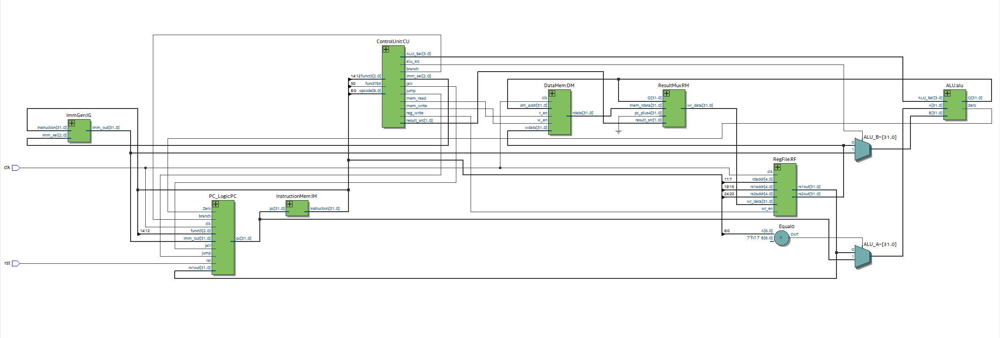
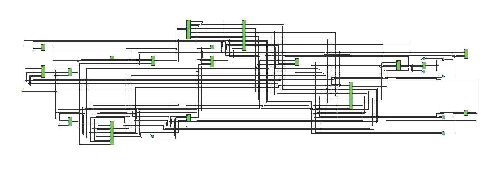

# RV32I Core

A custom 32-bit RISC-V processor written in SystemVerilog, developed to learn modern CPU and SoC design from the ground up.

The project evolved from a single-cycle RV32I implementation into a fully pipelined 5-stage processor with forwarding, hazard detection, branch control, unified memory, bare-metal C support, and FPGA deployment on an Intel Cyclone IV.

## What This Project Is

This project implements a subset of the RISC-V ISA (RV32I) in two versions:

- `SingleCore/`: a single-cycle baseline core

- `5-Stage-Pipeline/`: a pipelined core (IF/ID/EX/MEM/WB)


The pipelined version is the main focus and includes:

- Pipeline registers: `IF_ID`, `ID_EX`, `EX_MEM`, `MEM_WB`
- Hazard detection for load-use stalls
- Forwarding paths to reduce bubbles
- Branch and jump control (`beq`, `bne`, signed/unsigned compare branches, `jal`, `jalr`)
- Unified instruction/data memory through `UnifiedMem.sv`
- Memory alignment detection for byte/halfword/word accesses
- Basic performance counters through `Monitor.sv` (cycles, instructions, stalls, flushes, forwards)


## Repository Layout

- `5-Stage-Pipeline/`
- `5-Stage-Pipeline/RV32I_Pipeline.sv`: top-level pipelined CPU
- `5-Stage-Pipeline/RV32I_Pipeline_tb.sv`: testbench
- `5-Stage-Pipeline/UnifiedMem.sv`: unified memory used for instruction fetch and data access
- `5-Stage-Pipeline/tests/asm/`: assembly tests (`.S`)
- `5-Stage-Pipeline/tests/programs/`: generated hex programs loaded into unified memory
- `5-Stage-Pipeline/tests/assemble_all.py`: rebuilds all assembly tests by calling `tests.py`
- `5-Stage-Pipeline/tests/runall.do`: ModelSim batch run for the full suite
- `5-Stage-Pipeline/software/`: bare-metal C flow using `ctrl0.S`, `link.ld`, and `c.py`
- `SingleCore/`: earlier single-cycle implementation and testbenches

## SoC FPGA Implementation

The `SoC/` directory integrates the pipelined RV32I core with on-chip RAM,
memory-mapped GPIO, board-level debug outputs, and a bare-metal software flow.
The current FPGA target is an Intel Cyclone IV E `EP4CE115F29C7` device, with
`FPGAtop` as the Quartus top-level entity.

The SoC memory map is:

- RAM: `0x0000_0000` to `0x0000_FFFF`
- GPIO output register: `0x1000_0000`
- GPIO input register: `0x1000_0004`

The top level maps GPIO bit 0 to `LEDR0`, maps the current PC to `HEX0` through
`HEX3`, and maps debug status to `HEX4` and `HEX5`. Debug status bits are:

- bit 7: reset asserted
- bit 6: GPIO write observed
- bit 5: RAM write observed
- bit 4: RAM read observed
- bit 3: current GPIO address select
- bit 2: current RAM address select
- bit 1: misaligned access observed
- bit 0: current GPIO output bit 0

The FPGA project includes `SoC1.sdc`, which constrains the board oscillator to
50 MHz. `ClockDivider.sv` is currently connected at the top level as a 2 Hz
debug CPU clock so PC activity can be observed on the seven-segment displays.
This clock is intended for bring-up; return the SoC to the 50 MHz clock for
normal software timing.

### Building and Programming the SoC

From `SoC/software`:

```powershell
python c.py blink
```

The script emits an ELF, binary, disassembly listing, Intel HEX file, and
Quartus MIF file under `elf/`, `bin/`, `asm/`, and `programs/`. After changing
software, recompile `SoC1.qpf` in Quartus so the new MIF is embedded in the
generated `output_files/SoC1.sof`, then program that SOF through USB-Blaster.

Release `SW0` after programming; it is the active-high processor reset.

## Supported Instruction Categories (Current)

The tests in `5-Stage-Pipeline/tests/asm/` currently cover core RV32I categories:

- R-type ALU: `add`, `sub`, `and`, `or`, `xor`, `sll`, `srl`, `sra`
- I-type ALU: `addi`, `andi`, `ori`, `xori`
- Memory: `lb`, `lbu`, `lh`, `lhu`, `lw`, `sb`, `sh`, `sw`
- Branches: `beq`, `bne`, plus signed/unsigned branch matrix tests
- Jumps: `jal`, `jalr`
- Pipeline-focused directed tests: load-use hazards, dual forwarding, branch condition matrix, jalr link behavior
- Misaligned memory access tests for halfword and word loads/stores

## Test Strategy

Each assembly test follows the same structure:

- run instruction sequence
- branch to `pass` or `fail`
- write `1` (pass) or `2` (fail) to test status address `0x0000_F000`

The testbench watches `dut.UM.mem[0x0000_F000 >> 2]` and prints pass/fail and counters.

Because the pipelined core now uses unified memory, assembly tests should keep normal data stores away from the code region. The current convention is:

- addresses below `0x0000_0200`: treated as low/code memory by the testbench guard
- `0x0000_0200` and above: test data space
- `0x0000_F000`: pass/fail test status

The testbench also stops and reports context on misaligned memory accesses using the core's `misaligned` signal.

This was built out so that I can write programs to test the processor easier.

## How To Run

From `5-Stage-Pipeline/tests`:

1. Build hex for a single test:

   `python tests.py addi`

2. Build hex for every assembly test:

   `python assemble_all.py`

3. Run a single test in ModelSim:

    `vsim work.RV32I_Pipeline_tb +TEST=programs/cpitest.hex`

    Replace cpitest.hex with whatever specific test you want to run

4. Run the full simulation suite:

   `vsim -c -do runall.do`

5. Build a bare-metal C program:

   From `5-Stage-Pipeline/software`:

   `python c.py add`

   This uses `ctrl0.S` for startup, `link.ld` for the memory map, and emits `software/programs/add.hex`.

Notes:

- `tests.py` expects a RISC-V GCC toolchain in PATH (for example `riscv64-unknown-elf-gcc`).
- `software/c.py` uses the same RISC-V GCC toolchain and links with `-ffreestanding`, `-nostdlib`, and `-nostartfiles`.
- `runall.do` uses ModelSim/Questa batch mode.
- If ModelSim reports that `tests/work/_info` is permission denied, close any still-running `vsim` process or recreate the `work` library.

## What I Learned

Biggest takeaways from this project:

- Correct hazard handling is mostly about exact cycle timing, not just logic equations.
- Small control/datapath mismatches can cause hard-to-debug wrong-path behavior.
- Forwarding needs to be validated with directed dependency tests, not only simple ALU tests.
- A consistent pass/fail assembly harness makes regression testing much easier.
- A unified memory model simplifies software development, but scaling an SoC requires treating memory and peripherals as separate addressable modules.
- Memory interfaces should specify alignment, byte enables, and read-during-write behavior explicitly rather than relying on implementation defaults.
- Treating software as part of the hardware platform (memory images, linker scripts, startup code, and FPGA initialization) is essential when moving from simulation to real hardware.


## Next Steps

Architecture
------------
• Bus interface
• UART
• Timer interrupts

Graphics
---------
• VGA controller
• Tile renderer

Memory
------
• External SDRAM
• Cache investigation

Software
--------
• Bare-metal runtime
• Simple game


By Jaiden Stipp - 2026
